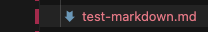
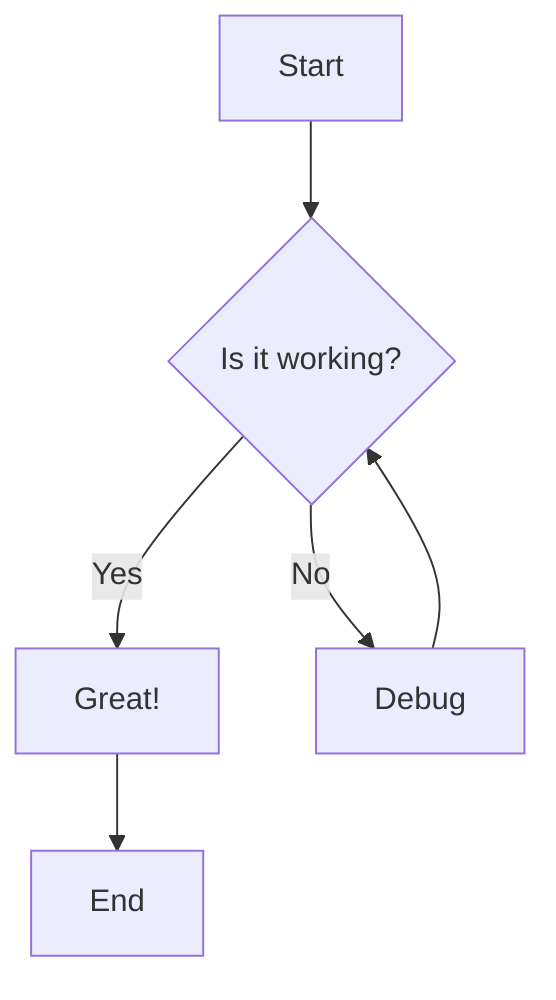
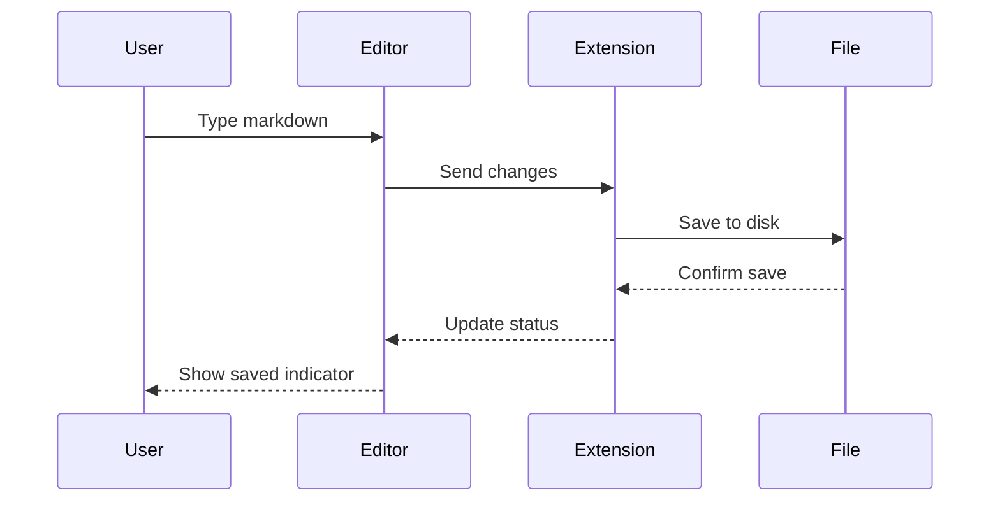
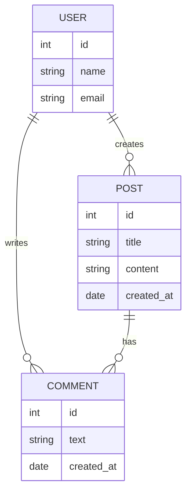
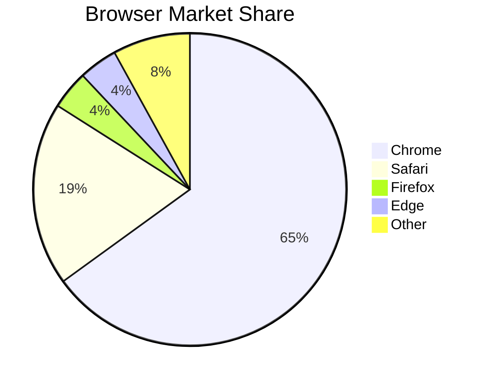
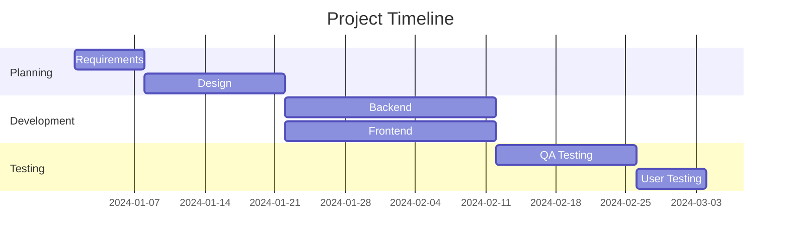

# Comprehensive Markdown Test File

This file tests all markdown features supported by the SlashMD editor.

---

## Headings

# Heading 1

## Heading 2

### Heading 3

#### Heading 4

##### Heading 5

###### Heading 6

---

## Text Formatting

This is **bold text** using double asterisks.

This is **bold text** using double underscores.

This is *italic text* using single asterisks.

This is *italic text* using single underscores.

This is *bold and italic* using triple asterisks.

This is *bold and italic* using triple underscores.

This is ~~strikethrough text~~ using tildes.

This is `inline acode` using backticks.

This is ==highlighted text== using double equals (if supported).

---

## Links

Here is a [link to Google](https://www.google.com).

Here is a [link with title](https://www.google.com).

Here is an auto-linked URL: <https://www.example.com>

### Wiki-Links (Obsidian/Foam Style)

Wiki-links use double brackets: [[notes|Display Text]]

Here's a wiki-link with alias: [[my-project|My Project]]

Simple wiki-link without alias: [[notes|]]

Multiple wiki-links in a sentence: See [[architecture|Architecture]] and [[design|Design]] for details.

### Reference-Style Link Definitions

These are metadata used by Foam and should be hidden from view (not rendered).

---

## Images

### Remote Image


### Local Image



### Image with Text Around It

Before the image


and after the image.

---

## Lists

### Unordered List

- First item
- Second item
  - Nested item 1
  - Nested item 2
    - Deeply nested
- Third item

### Ordered List

1. First item
2. Second item
   1. Nested item 1
   2. Nested item 2
3. Third item

### Task List (Checkboxes)

- Unchecked task
- Checked task
- Another unchecked task
- Another checked task

### Mixed List

1. First ordered item
   - Nested bullet
   - Another bullet
2. Second ordered item
   - Task inside ordered list

---

## Blockquotes

> This is a simple blockquote.

> This is a multi-line blockquote.
> It continues on this line.
> And this line too.

> Nested blockquotes:

---

## Callouts (Admonitions)

> \[!NOTE]
> This is a note callout. Use it for general information.

> \[!TIP]
> This is a tip callout. Use it for helpful suggestions.

> \[!WARNING]
> This is a warning callout. Use it for important warnings.

> \[!IMPORTANT]
> This is an important callout. Use it for critical information.

> \[!CAUTION]
> This is a caution callout. Use it for dangerous actions.

---

## Code Blocks

### JavaScript

```javascript
function greet(name) {
  console.log(`Hello, ${name}!`);
  return {
    message: `Welcome, ${name}`,
    timestamp: Date.now()
  };
}

greet('World');
`
```

### TypeScript

```typescript
interface User {
  id: number;
  name: string;
  email: string;
}

const getUser = async (id: number): Promise<User> => {
  const response = await fetch(`/api/users/${id}`);
  return response.json();
};
```

### Python

```python
def fibonacci(n: int) -> list[int]:
    """Generate Fibonacci sequence up to n numbers."""
    if n <= 0:
        return []
    elif n == 1:
        return [0]
    
    sequence = [0, 1]
    while len(sequence) < n:
        sequence.append(sequence[-1] + sequence[-2])
    return sequence

print(fibonacci(10))
```

### Shell/Bash

```bash
#!/bin/bash

# Install dependencies
npm install

# Build the project
npm run build

# Run tests
npm test
```

### JSON

```json
{
  "name": "slashmd",
  "version": "1.0.0",
  "description": "A WYSIWYG Markdown editor for VS Code",
  "features": ["live-preview", "markdown-shortcuts", "images"],
  "settings": {
    "theme": "dark",
    "fontSize": 14
  }
}
```

### CSS

```css
.editor {
  font-family: 'Inter', sans-serif;
  line-height: 1.6;
  padding: 2rem;
  background: linear-gradient(135deg, #1a1a2e 0%, #16213e 100%);
}

.editor::selection {
  background-color: rgba(99, 102, 241, 0.3);
}
```

### Plain Text (No Syntax Highlighting)

```javascript
This is plain text in a code block.
No syntax highlighting is applied.
Useful for logs or generic output.
```

---

## Tables

### Simple Table

| Name    | Age | City          |
| ------- | --- | ------------- |
| Alice   | 28  | New York      |
| Bob     | 34  | San Francisco |
| Charlie | 22  | London        |

### Table with Alignment

| Left Aligned | Center Aligned | Right Aligned |
| ------------ | -------------- | ------------- |
| Left         | Center         | Right         |
| Text         | Text           | Text          |
| More         | More           | More          |

### Complex Table

| Feature       | Supported | Notes                        |
| ------------- | --------- | ---------------------------- |
| Bold          | ✅         | Use `**text**` or `__text__` |
| Italic        | ✅         | Use `*text*` or `_text_`     |
| Strikethrough | ✅         | Use `~~text~~`               |
| Code          | ✅         | Use `` `text` ``             |
| Links         | ✅         | Use `[text](url)`            |
| Images        | ✅         | Use ``            |
| Tables        | ✅         | GFM syntax                   |
| Math          | ⚠️        | Requires extension           |
| Mermaid       | ⚠️        | Requires extension           |

---

## Horizontal Rules

Above the rule.

---

Below the rule.

---

Another style of rule.

---

Yet another style.

---

## Toggle/Details Blocks

<details><summary>Click to expand this section</summary>

This content is hidden by default. Click the summary to reveal it.

You can include any markdown here:

- Lists
- **Bold text**
- `Code`

</details>

<details open><summary>This section starts expanded</summary>

This content is visible by default because of the `open` attribute.

```javascript
console.log('Code inside a toggle!');
```

</details>

---

## Math (LaTeX)

### Inline Math

The quadratic formula is $x = \frac{-b \pm \sqrt{b^2 - 4ac}}{2a}$ for solving $ax^2 + bx + c = 0$.

Einstein's famous equation: $E = mc^2$

### Block Math

$\int_{-\infty}^{\infty} e^{-x^2} dx = \sqrt{\pi}$

$\sum_{n=1}^{\infty} \frac{1}{n^2} = \frac{\pi^2}{6}$

$\nabla \times \mathbf{E} = -\frac{\partial \mathbf{B}}{\partial t}$

---

## Mermaid Diagrams

### Flowchart



### Sequence Diagram



### Entity Relationship Diagram



### Pie Chart



### Gantt Chart



---

## Special Characters & Escaping

These characters need escaping in certain contexts:

- Asterisks: \*not italic\*
- Underscores: \_not italic\_
- Backticks: \`not code\`
- Hash: # not a heading
- Brackets: \[not a link]
- Pipes in tables need escaping: |

---

## Emoji (if supported)

Common emojis: 🎉 🚀 ✅ ❌ ⚠️ 💡 📝 🔧 🐛 ✨

---

## HTML (Limited Support)

Centered bold text using HTML

\<kbd>Ctrl\</kbd> + \<kbd>S\</kbd> to save

---

## Edge Cases

### Empty Elements

-
-

>

### Very Long Line

This is a very long line of text that should wrap properly in the editor. It contains enough words to test how the editor handles line wrapping and whether it maintains readability. Lorem ipsum dolor sit amet, consectetur adipiscing elit. Sed do eiusmod tempor incididunt ut labore et dolore magna aliqua.

### Special Unicode

Greek: α β γ δ ε ζ η θ

Math symbols: ∑ ∏ ∫ ∂ ∇ ∞ ≠ ≤ ≥ ≈

Arrows: → ← ↑ ↓ ↔ ⇒ ⇐ ⇑ ⇓

Boxes: □ ■ ▢ ▣ ◯ ● ◎

---

## End of Test File

If you can see all sections rendered correctly, the editor is working! 🎉
